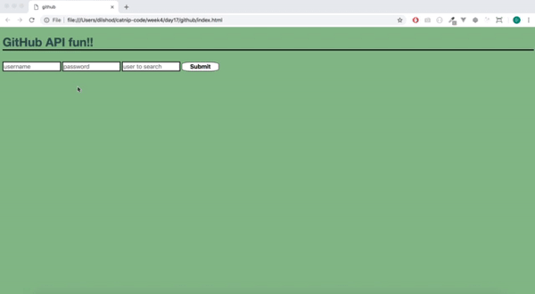

# GitHub API

Let's use the <a href="https://developer.github.com/v3/">GitHub API</a> to make a UI that allows users to see a list of public repos belonging to a GitHub user that they specify and to see the last 10 commits made to each.

When  users arrive at this page they should be asked to enter their GitHub username and password. The GitHub API doesn't require authentication but without a username and password we will run up against rate limits very quickly. Once you have the user's username and password, you can use them to build an `Authorization` header. The value of this header should be the string `'Basic `' followed by the username and password joined on `':'` and [base64](https://en.wikipedia.org/wiki/Base640) encoded. The [btoa](https://developer.mozilla.org/en/docs/Web/API/WindowBase64/Base64_encoding_and_decoding) function can be used to base64 encode. For example:

```js
$.ajax({
    url: myGithubApiUrl,
    headers: {
       Authorization: 'Basic ' + btoa(username + ':' + password)
    }
});
```

You can use the <a href="https://developer.github.com/v3/repos/#list-user-repositories">`/users/:username/repos`</a> endpoint to get the list of repos. The owner of each repo will be indicated in the response and you should show the owner's profile picture next to each repo name.

When users click on a repo you should make a request to <a href="https://developer.github.com/v3/repos/commits/">`/repos/:owner/:repo/commits`</a> endpoint to get a list of commits. You should show only the last ten commit messages.

Handlebars should be used for HTML rendering.

A couple of things to keep in mind:

1. There should be no ajax request made when the user has only entered her username and password. The only ajax requests to make are the ones to get the repos and the commits. There is no "logging in" to the API. The user's username and password should only be used to construct the `Authorization` header that must be included in all requests to get the repos and commits.

2. **DO NOT PUT YOUR GITHUB USER NAME AND PASSWORD INTO YOUR SOURCE CODE**. The whole point of having the username and password fields for this project is to avoid doing that.



*Bonus Exercise* - If the user clicks a repo a second time, hide the commits. If the user clicks that repo again, display the commits again without fetching them again.
